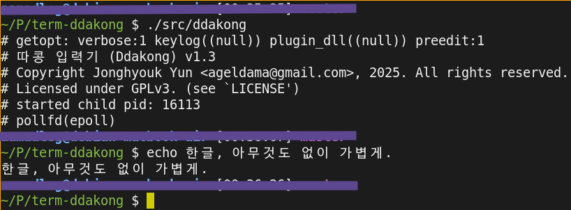

* ddakong

  ANSI C99-으로 작성된 가볍고 빠른 Hackable한 터미널 (한글/UTF-8) 입력기

  1) 다른 라이브러리 의존성 없음.

  2) x86_64 / Release 빌드 실행파일 크기: 약 =110 KiB=.

  3) X윈도, Wayland 등 의존성 없음.
     - linux console/terminal에서 바로 실행가능.
     - (예: https://gjedeer.github.io/fbterm/ 등과 함께)

  4) Shared-Library DLL을 작성하거나, Lua 스크립팅으로
     원하는대로 hackable 🧨🪓:
     - input-method 전환키 변경
     - UTF-8 인코딩 이외에 입력하도록 변경
     - 한글 이외 다른 언어 입력기으로 변경
     - 2벌식 이외에 다른 입력자판으로 변경

  5) x86-i686, x86_64, aarch64, armhf 및 GNU/Linux, FreeBSD을 지원합니다.
     - (MacOS/Darwin 등은 미테스트)

  기본내장으로 UTF-8, 2벌식 한글키보드를 지원합니다.

  

* 사용법

   1) ~./ddakong~ : 실행, ~SHELL~-환경변수의 쉘이 실행됨.
      - ~fbterm /usr/local/bin/ddakong~-처럼 아예 fbterm에서 매
        vconsole마다 열리도록 하면 편함.
      - ~SHELL~-환경변수는 실행파일의 경로만 지정가능합니다.
        - 인자를 전달해야 하거나 하다면, 쉘스크립트으로 작성하여 그
          경로를 지정해야 합니다.

   2) ~Control+h~ 키를 누르면 한글모드으로 전환합니다.
      - 조합중인 한글(pre-edit 문자)도 커서위치에 표시합니다.
        - 터미널 제어 시퀀스(DSR ~ESC[6n~ 커서위치 확인)를 이용하여
          그리고/지우기 때문에, 이를 지원하지 않는 터미널에서는
          자동으로 표시를 안합니다. (~-P~ 옵션으로 아예 끌 수도
          있습니다.)
      - 버그가 있을 수 있습니다. (...방금 만들었습니다.)

   3) ~Control+h~ 키를 2번 연속 누르면, 그냥 ~C-h~ 문자가 입력됩니다.
      - (전통적인 유닉스 터미널에서 backspace-역할)

   4) 추가기능: 자음은 2번 연속 누르면 쌍자음으로 변환합니다.
      - (예) ㄱ + ㄱ => ㄲ.

   커맨드라인 옵션:

   #+begin_src shell
     # ./ddakong  -h

     # 따콩 입력기 (Ddakong) v0.0.7
     # Copyright Jonghyouk Yun <ageldama@gmail.com>, 2025. All rights reserved.
     # Licensed under GPLv3. (see `LICENSE')
     Usage: ./src/ddakong [-h] [-q] [-l KEYLOG]
     	Option (-h) : Show help 도움말
     	Option (-q) : Quiet STDERR-에 메시지 쓰지 않기
     	Option (-l FILENAME) : Write keylog to specified file
     	                       지정한 파일에 키로깅
     	Option (-d FILENAME) : DLL-file to load as plugin
     	                       플러그인 DLL파일
     	Option (-L) : Write keylog to `KEYLOG.txt'
     	Option (-P) : No pre-edit 조합중인 글자를 표시하지 않기
   #+end_src

  저는 fbterm-와 함께 다음과 같이 사용합니다:
  (Ctrl-Alt-C 으로 새로운 콘솔을 열 때마다 자동으로 함께 열립니다.)

  #+begin_src shell
    fbterm -n NeoDunggeunmo\ Code -s 20 --font-width 10 -- ~/local/bin/ddakong
  #+end_src

* 주의사항
  - ~emacs -nw~-와는 잘 동작하지 못합니다. ㅠ.ㅠ
    (어차피 이맥스에서는 내장한글입력기가 있어서 큰 문제는 없습니다.)

    - ddakong, emacs 모두 termios을 제어하는 프로그램이어서 그런 것 같습니다.

* 설치

  https://github.com/ageldama/term-ddakong/releases

  ...여기에서 실행파일을 다운로드 받아서 실행

** 직접빌드

   1. x86_64, [[https://gcc.gnu.org/gcc-12/][gcc 12+]], [[https://wiki.debian.org/DebianStable][debian stable]]-에서 작업/테스트햇습니다.
      - ...특별히 쓴게 없어서 다른 환경에서도 잘 굴러갈거 같습니다.

   2. gcc 12+, gnu make 4.3+ 이 필요합니다.

   #+begin_src shell
     git clone git@github.com:ageldama/term-ddakong.git
     cd term-ddakong
     ./configure # _or_ ./configure --prefix=/usr/local
     make

     # `src/ddakong` 실행파일 생성됨, 복사하여 사용하거나,
     make install
   #+end_src

* Plug-in: DLL

  Shared Library을 작성하여, 다음의 기능들을 변경할 수 있습니다:

  1. Control-H 토글키
  2. UTF-8 인코딩 이외의 인코딩 출력
  3. 한글2벌식 이외의 키보드 지원
  4. 한글 이외의 입력지 작성

  플러그인 예시를 빌드/실행하는 방법:

  #+begin_src shell
    cd ./plugins/random-phrase/
    ./configure && make cp-lib

    # 빌드된 플러그인을 로딩하여 실행:
    ddakong -d ./librandom_phrase_ddakong.so
  #+end_src

  ddakong의 내장된 모든 함수를 플러그인 DLL에 전달하여 호출하여
  원하는대로 hack할 수 있습니다.🧨(예제 플러그인의 코드 참고)

  ➡️ [[./doc/PLUGIN-API.org]] 문서에 자세한 플러그인 API을 설명

* Plug-in: Lua scripting
  자동으로 ~plugins/lua~-에 내장된 Lua 5.4.7 코드를 이용하여
  빌드됩니다.

  LuaJIT등 별도 Lua을 사용하려면,

  1) ~./configure --with-lua=yes --with-lua-cflags=...
     --with-lua-libs=...~
  2) 혹은 더 단순히 ~./configure --with-lua-pkg-config=lua~
     - ~pkg-config --list-all |grep lua~-하여 검색된 설치된 lua을
       사용합니다. (예: ~--with-lua-pkg-config=lua5.4~)

  Lua 스크립팅으로 원하는대로 수정이 가능합니다. 간단한 예시는 다음과
  같이 ~make cp-lib~-이후에 실행해 볼 수 있습니다:

  #+begin_src shell
    $ DDAKONG_LUA=$PWD/plugins/lua/examples/passthru.lua ./src/ddakong -d ./plugins/lua/liblua_ddakong.so
  #+end_src

  위에서 보는 것과 같이 ~-d ...~ 옵션으로 lua-plugin DLL을 로딩하도록 하고,
  ~DDAKONG_LUA=~ 환경변수에 로딩할 루아 스크립트를 지정합니다.

  이 환경변수를 지정하지 않으면 ~$HOME/.ddakong/init.lua~-파일을
  로딩합니다.

  ➡️ [[./doc/PLUGIN-API.org]] 문서에 자세한 플러그인 API을 설명

* 라이센스 / License
  [[https://www.gnu.org/licenses/gpl-3.0.html#top][GPLv3]] 을 따릅니다.

  - 참고: https://ko.wikipedia.org/wiki/GNU_%EC%9D%BC%EB%B0%98_%EA%B3%B5%EC%A4%91_%EC%82%AC%EC%9A%A9_%ED%97%88%EA%B0%80%EC%84%9C

